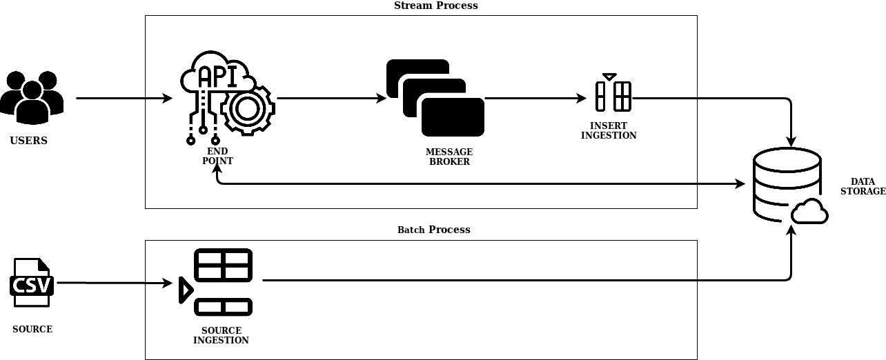
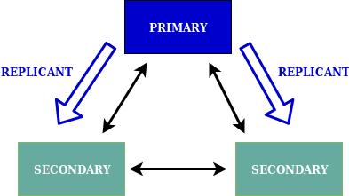
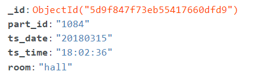
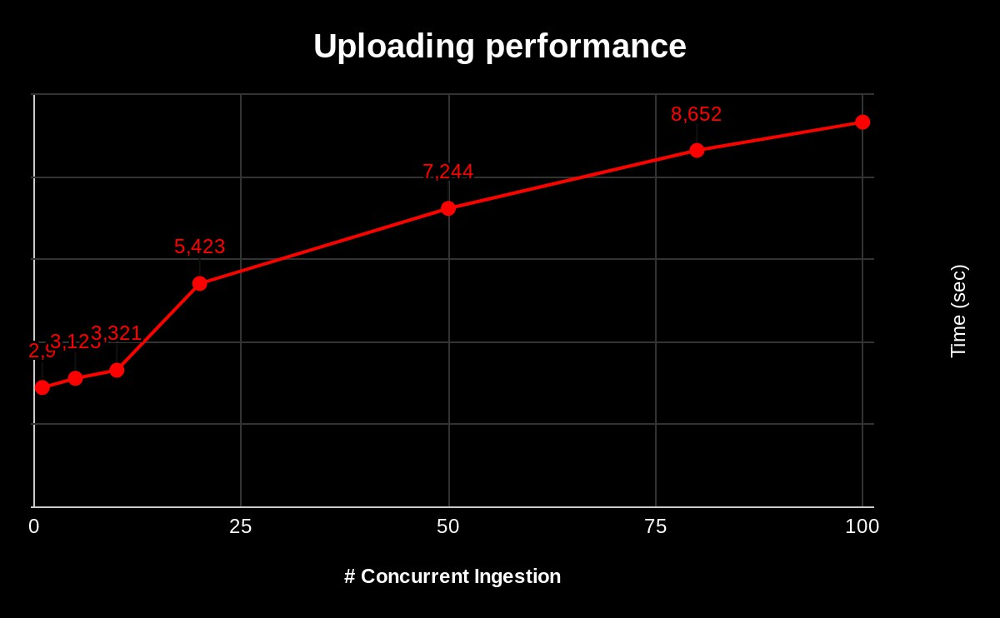

# Assignment Report - 801979

# Part 1

## 1. Design and explain interactions between main components in your architecture of mysimbdp

The designed architecture is composed of different components in order to manage the different scenarios. 
It is composed mainly of two different layers. The first one is the batch process where the data ingestion of the source database can be done, it is composed by an API where 
the admin user can ingest the source file and it interact directly with the data storage. The second is the streaming process, where 
the tenants requests are managed. It is composed by an API end point where the user can interacts and make request. After this we have an intermediary component, the message broker
that generate queues to manage publisher/supplier connection. In addition, the main benefit of the message broker rise 
when the system scale-up and new consumers need to access to the users requests, they can directly be connected to the 
message broker so there is no need to modify the API that interacts with the user. Finally the message broker sent the user request to the data
storage. Between the message broker and the data storage there is a daemon program that maps the message from the broker
to the data storage.

Now that the global idea is explained, we define the main technology and components of our system.
To implement the **mysimbdp-daas** Flask has been used. It generates an end point and the APIs that interact with the users. The APIs are made for both: general users and admin users.
We used rabbitMQ as message broker since it has easy setup and deployment as well as it has all the features required for 
the project. To implement the **mysimbdp-coredms** mongoDP Atlas has been used. In general, it provides a cloud solution
with tree clusters of mongoDB. MongoDB has been selected among the possible solutions for its easy and fast implementation. 
**mysimbdp-dataingest** is composed of two different components. The first one is a Script that can be lounched
to push a source into the data storage, in our case a CSV file. The second component is a daemon that receive
messages from the broker and pushes them into the data storage.

The previous figure represents the implemented structure. First of all the admin user can import the sources using the source ingestion script
that is directly connected with mongoDB. MongoDB Atlas provides a cloud solution where I have created a cluster of 3 nodes where all the 
data are stored and replicated. Afterword, the users can interact with the Flask end point and make POST/GET requests.
In the case of POST requests, they are forwarded to the queue(RabbitMQ). In the case of GET requests they are forwarded directly to
the mongoDB data storage.
To highlight, RabbitMQ has been implemented as a Service using the CloudAMQP webservice. This choice was made to speed up the implementation time. (It might be not the best solution but given the inexperience seemed the easiest one)

## 2. Explain how many nodes are needed in the deployment of mysimbdp-coredms so that this component can work property (theoretically based on the selected technology)
The **mysimbdp-coredms**, as mentioned before, has been implemented using MongoDB. Specifically, using the fully-managed cloud solution
MongoDB Atlas. This solution was mainly selected since it is an easy implementation. 3 nodes have been deployed as minimum 
value needed to guarantee that the components work properly. The selected number is due to the fact that the minimum 
architecture of a replica set has three members. A primary node and two secondary nodes where the data are replicated. Both the secondaries can become the primary in an election
(it occur when the primary becomes unavailable and the replica set members autonomously
select a new primary), following a figure to show the schema.

Given that the data are replicated in all the two secondaries, this deployment provides full tolerance
and high availability since in case of unavailability of a node, the cluster is still composed of a primary node 
as well as of a replica. Moreover, in the selected solution (moongoDB Atlas), a rollback is implemented where
write operations on a former primary when the member rejoins the replica set after a failover.
## 3. Will you use VMs or containers for mysimbdp and explain the reasons for each component

In my opinion, in a general big data architecture, some components should be virtualized since they gain advantages and some components should not be virtualized. First of all, I think that all the data storage components should not be virtualized due to the memory has to be persistent, meaning that, the system cannot allow to losing track of the data. As a result store, the data on bare metal is a better solution. On the other hand, virtualization can be used to deploy almost all the other components such as message brokers and API endpoints. On of the main advantages of this is the possibility to scale out or scale up all of this component quickly to adapt to the different needs and requests that the big data architecture receives.
Speaking about an ideal implementation I will use containers in order to deploy the Flask server instances, the message broker RabbitMQ, and the daemon instances. This is mainly due to the efficient and effective way that containers offer to scale out\in such instances. Finally. if the data store cannot be memorized on bare metal the VM should be used to deploy such components.

## 4. Explain how would you scale mysimbdp to allow a lot of users using mysimbdp-dataingest to push data into mysimbdp
First of all, given that in the implemented system the sources can be ingested only from a basic script, the first step is to make it as a web server such as an API for the sources ingestion where multiple users can access to, it can be another API of the Flask server. As the second step, multiple instances of the flask server should be generated in order to guarantee parallel access to the APIs. Furthermore, the instances of the daemon should be replicated to deal with the increasing number of POST requests. Finally, the issue of the coredms is more complicated. If we consider that all the replica should be up to date and include all the same data, increasing the number of nodes of the cluster can slow down the process generating a bottleneck. Contrary, we can scale-up the 3 nodes resources in order to make the system faster. In case that the number of GET requests is really bigger compared to the number of POST requests we can consider to horizontally scale the system as well.

## 5. Explain your choice of industrial cloud infrastructure and/or mysimbdp-coredms provider, when you do not have enough infrastructural resources for provisioning mysimbdp
I interpreted the question in a way that I have to simulate a scenario in which I do not have enough infrastructural resources so I have to choose between cloud solution and/or coredms providers as well as I have limited funds. 

First of all, since the MongoDB Atlas has limited resources I would move the data storage on a cloud provider such as AWS. Right now, I will choose AWS since is the only one in which I have experience with as well as it has a pay-as-you-go basis method, which means I can optimize the funds related to the actual resources needed. In addition, also RabbitMQ has limited resources, it can be deployed on the cloud as well. Regarding the other components, we can use locally containerization to optimize the resources allocated.

# Part 2

## 1. Design and explain the data schema/structure for mysimbdp-coredms
The database selected is the Indoor [Localization Dataset](https://zenodo.org/record/2671590#.XXJahPxRUlU). It contains information concerning the older people’s movement inside their homes regarding their indoor location in the home setting.

Each record of the dataset has the following fields:
* **part_id**: The user ID, which should be a 4-digit number
* **ts_date**: The recording date, which follows the “YYYYMMDD” format, e.g. 14 September 2017, is formatted as 20170914
* **ts_time**: The recording time, which follows the “hh:mm:ss” format
* **room**: The room which the person entered on the specific date and time (It is assumed that the person remained in the room till the next recording of the same day)

As mentioned previously, the coredms selected is MongoDb. This implies that the data has to be saved as documents(JSON). I have created one database called test with one collection called documents where all the input records will be stored. The **part_id** and **ts_date** are saved as an integer in order to optimize the memory. The **ts_time** and the **room** features are saved as strings.

Finally. the collection is replicated in all the 3 shards.
MongoDB will automatically add the auto-increment id in the entries. Following an example of an entry

## 2. Explain how would you partition the data in mysimbdp-coredms into different shards/partitionshe
Given that the number of fields is really little is not valuable to partition the data set vertically, so I will partition it horizontally. In the case of different shards, I will partition the database on part_id since it is the field that I used as a filter inside the GET API. In this way, the look-up time will be faster.

## 3. Write a mysimbdp-dataingest that takes data from your selected sources and stores the data into mysimbdp-coredms
The implementation of this components is the **ingestSource.py** file inside the code directory.

## 4. Given your deployment environment, show the uploading performance (response time and failure) of the tests for 1,5, 10, .., n of concurrent mysimbdp-dataingest pushing data into mysimbdp-coredms
The ingestion of the source (ingestSource.py) has been tested with concurrent pushes to the data storage. It has been tested with n = 1,5,10,20,80,100.

As we can see from the above plot, the time increase with the increasing of the number of concurrent ingestions. The values are the average of all the samples for the different trials.
## 5. Observing the performance and failure problems when you push a lot of data into mysimbdp-coredms (you do not need to worry about duplicated data in mysimbdp), propose the change of your deployment to avoid such problems (or explain why you do not have any problem with your deployment)
When the number of concurrent ingestion was 100 my system started to have some failure. In particular are related with pymongo and some indexError (pop form an empty deque). I did not have time to analyse deeper the problem. A possible solution could scale up or scale out the data storage (MongoDB) but since I do not know where the problem is I cannot think of a more accurate solution. 

# Part 3
## 1. Assume that each of your tenants/users will need a dedicated mysimbdp-coredms. Design the data schema of service information for mysimbdp-coredms that can be published into an existing registry (like ZooKeeper, consul or etcd) so that you can find information about which mysimbdp-coredms for which tenants/users.
## 2. Assume that the service information about mysimbdp-coredms for a tenant/users is in a file, write a program that can be used to publish the service information of mysimbdp- coredms into either etcd, consul or Zookeeper 
## 3. Explain how you would change the implementation of mysimbdp-dataingest (in Part 2) to integrate a service discovery feature (no implementation is required) 
I will change the **mysimbdp-datainges** to have a microservice-base architecture so that we can increase the modularity. The service discovery will be used to automatically detect the different data ingestion locations.
## 4. Explain APIs you would design for mysimbdp-daas so that any other developer who wants to implement mysimbdp-dataingest can write his/her own ingestion program to write the data into mysimbdp-coredms by calling mysimbdp-daas 
The API should provide a means for any developer to perform insert on a large number of entry. In addition, they can perform updates on various attributes. Hence, the API should have an endpoint that can accept in input one or more files and that it is flexible on the structure of it.
## 5. Assume that now only mysimbdp-daas can read and write data into mysimbdp-coredms, how would you change your mysimbdp-dataingest (in Part 2) to work with mysimbdp- daas 
This solution can be implemented adding a new API to the actual server where it can get as input the whole csv file so that the source ingestion should passed from the **mysimbdp-daas** and not directly to the database.

# Bonus points

The implementation of **mysimbdp-daas** have been done. Not all the tested have benn implemented though.