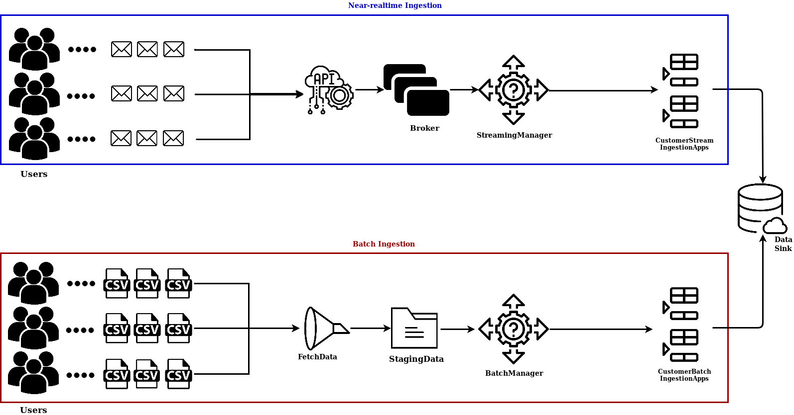
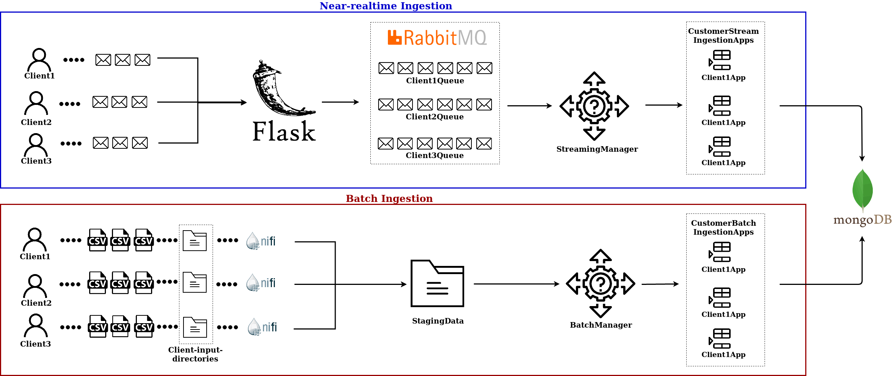

# Assignment 2 Report - working on data ingestion features - 801979
As first part of the report, an overview of the designed and implemented structure will be explained. Moreover, the connections with the first assignment will be introduced in order to continue with the course story. 
The focus of this assignment is on the data ingestion part of the structure. In general it is divided in two main flows, the batch-ingestion part and the real-time ingestion. Although, this difference has been already highlighted in the previous assignment, some additional features were required in this second one. The main different constraint is that the platform in this assignment have to deal with multi-tenancy as a result the design required a different configuration. Each customer has its own data but it has been assumed that all of them use the same database/storage model. The data sink has been implemented using mongoDB Atlas, thus, the data model selected is document-based. In addition, the customer is the one that will design the data structure.

Following the structure implemented in the first assignment: 

To sum up, the user can import the sources using the source ingestion script that is directly connected with mongoDB. MongoDB Atlas provides a cloud solution where a cluster of 3 nodes have been created so that all the data are stored and replicated. Afterword, the user can interact with the Flask end point and make POST/GET requests. In the case of POST requests, they are forwarded to the message broker(RabbitMQ). In the case of GET requests they are forwarded directly to the mongoDB data storage. To highlight, RabbitMQ has been implemented as a Service using the CloudAMQP webservice. This choice was made to speed up the implementation time.

#### New implementation

Starting from the previous implementation the new architecture has been designed. Some of the components have been reused and adapted to the new constraints. The same data sink have been used for his implementation practicality, mongoDB Atlas provide a consistent and easy to use solution. The multi-tenancy require different components and the design has to be adapted as well. Following the new design in brief: 

The above picture shows the general design of the architecture, it is mainly divided in two flow as mentioned before. The batch ingestion allow multiple users to send data as CSV files to the platform. After that, a component (fetchData) automatically detect which file should be ingested based on some predefined constraints. Once the files are validated, they will be pushed inside the staging data, in our case a local directory where they wait the batchManager to forward them to the correct customer batch ingestion app. Finally, the data will be pushed to the data sink. Regarding the near realtime ingestion flow users can interact with the platform throughout API. They can send POST request to the server which will forward the data to the message broker. After that a streaming manager will activate the needed customer stream ingestion application in charge to push the messages to the data sink. 

During the project some technologies have been explored and analysed to implement the different components. Given the inexperience as well as the number of potential different solutions, this process took a lot of time of the overall time spent to do the assignment. In the following picture the final implemented architecture is shown:

- new architecture explain different solution 
- platform task and client task
# Part 1 - Ingestion with batch

# Part 2 - Near-realtime ingestsion 

# Part 3 - Integration and Extension

# Bonus Points
